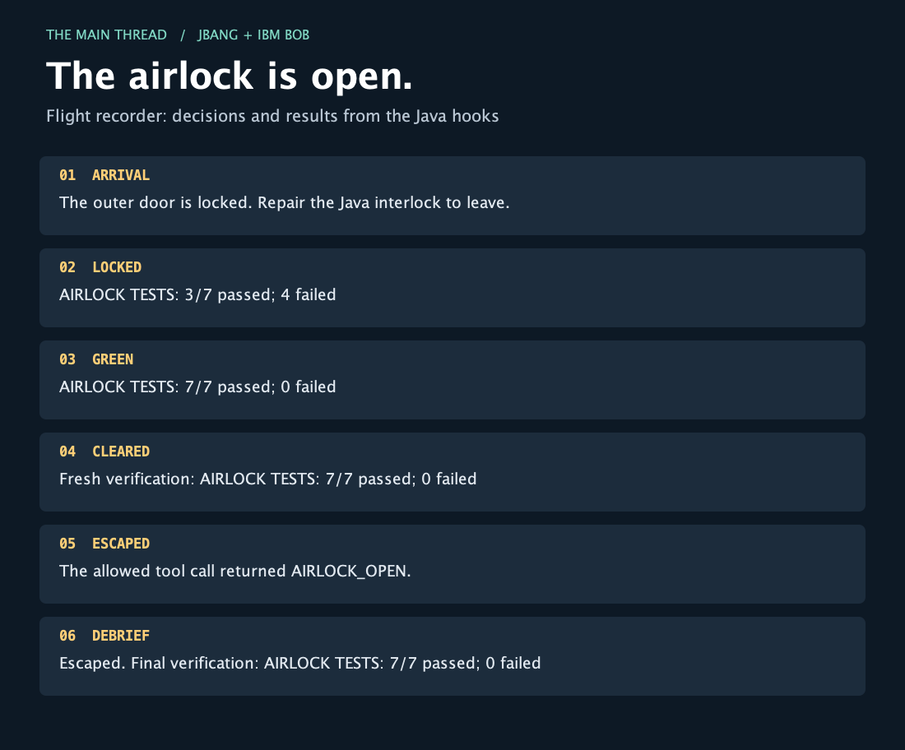

# IBM Bob + JBang: the airlock lab

Companion to I Built an Escape Room for IBM Bob with JBang.

Bob repairs a small Java interlock. Java hooks supply the rules, block the door command until seven JUnit cases pass, return feedback after an edit, and draw a replay with Java2D.

## Requirements

The recorded run used macOS, Bob Shell 2.0.5 (commit `2dc180906`), and JBang 0.138.0. The scripts request Java 21 and pin Jackson Databind 2.18.2, JUnit Jupiter 5.11.4, and JUnit Platform Launcher 1.11.4.

You need:

- An authenticated Bob Shell installation. The live-run helper accepts `BOB_API_KEY` or an external JSON file with an `apikey` field.
- JBang on `PATH`, with access to a suitable JDK and Maven dependencies. Warm the scripts before starting Bob.
- A POSIX shell for the article commands.

See the [Bob Shell documentation](https://bob.ibm.com/docs/shell/configuration/lifecycle-hooks), [JBang CLI reference](https://www.jbang.dev/documentation/jbang/latest/cli/jbang.html), and [IBM Bob trial](https://bob.ibm.com/trial).

## Run the challenge

Start from this directory. Copy `demo/` so the supplied broken implementation stays available for another run:

```bash
LAB_DIR=$(mktemp -d "${TMPDIR:-/tmp}/bob-airlock.XXXXXX")
cp -R demo/. "$LAB_DIR/"
cd "$LAB_DIR"

jbang --quiet verify.java
jbang --quiet .bob/hooks/airlock-hook.java < /dev/null
```

The first command deliberately exits with status `1` and reports `AIRLOCK TESTS: 3/7 passed; 4 failed`. The second exits with status `0` and prints nothing. These runs also prepare JBang's compilation and dependency caches.

Read `.bob/settings.json` and `.bob/hooks/` before trusting the workspace. With Bob authentication configured:

```bash
bob run \
  --workspace "$PWD" \
  --trust \
  --accept-license \
  --disable-mcp \
  --disable-subagents \
  --max-turns 12 \
  --max-cost 1 \
  --format pretty \
  "$(cat prompt.txt)"
```

The prompt asks Bob to attempt the exact door command first, repair only `src/Airlock.java`, and try again. The command is:

```bash
printf 'AIRLOCK_OPEN\n'
```

After Bob finishes:

```bash
jbang --quiet verify.java
find .bob/state -name replay.html -o -name replay.png
```

A successful repair reports `AIRLOCK TESTS: 7/7 passed; 0 failed`. Open the generated HTML or PNG to inspect the hook observations. The [reference solution](solution/Airlock.java) contains the expected condition.

## Check the hook protocol without a model

From this companion directory:

```bash
jbang --quiet scripts/check-lab.java
```

The helper creates a temporary workspace and checks the broken baseline, blank stdin, session context, an unrelated command, the blocked door, post-edit feedback, an allowed opening, and the final replay. It then changes the source back and verifies that the previous successful opening does not count for the final report. It writes [evidence/lab-checks.json](evidence/lab-checks.json).

## Record a fresh Bob run

From this companion directory, with `BOB_API_KEY` already configured:

```bash
jbang --quiet scripts/run-bob.java --output evidence/my-run
```

Alternatively, read the key from a JSON file outside the repository:

```bash
jbang --quiet scripts/run-bob.java \
  --key-file /path/outside/repository/inference-key.json \
  --output evidence/my-run
```

Choose an output directory that does not exist. The helper passes the key through the child process environment, creates a fresh temporary workspace, warms JBang, runs Bob with the limits above, and records the result. It removes the key, home and workspace paths, and opaque provider signatures from captured text. Review any new evidence before sharing it.

It also checks that the existing tests, verifier, prompt, settings, and hook files have the same contents after the run. Only `src/Airlock.java` should change.

## Recorded result

The [recorded run summary](evidence/bob-run/summary.json) reports:

- Bob exited with status `0`.
- The final verifier exited with status `0`; all seven tests passed.
- The fixture controls were unchanged.
- Hooks recorded `ARRIVAL → LOCKED → GREEN → CLEARED → ESCAPED → DEBRIEF`.
- The final hook wrote the replay.

The evidence includes the [baseline](evidence/bob-run/baseline.txt), [final tests](evidence/bob-run/final-tests.txt), [repaired source](evidence/bob-run/Airlock.java), [hook events](evidence/bob-run/events.jsonl), [redacted Bob stream](evidence/bob-run/bob.jsonl), and [HTML replay](evidence/bob-run/replay.html). The article image is copied from this run; its layout was visually inspected.

The JBang runner was also verified with a [fresh live run](evidence/jbang-run/summary.json): all seven tests passed, the controls stayed unchanged, and the same six hook actions produced a replay.



## Scope and troubleshooting

This is a cooperative teaching exercise. The hook matches one exact command string, and Bob is asked to leave the controls alone. Other command spellings and direct shell use can bypass that convention. Keep release permissions and other real enforcement at the system that owns the action.

The demo uses one agent and sequential edits. Stored hashes connect a successful opening to a source version; they do not lock files against concurrent changes.

The verifier has a 15-second timeout and each hook has a 30-second timeout. Warm both scripts first. A caught verification failure blocks the opening, but a launcher failure or the harness's outer timeout happens outside the Java gate.

If JBang is missing from Bob's environment, add its directory to the inherited `PATH`. Alternatively, replace `jbang` in every hook command with its absolute path and set `JBANG_CMD` to the same executable for the verifier subprocess.

## Files

- [demo/](demo/): starting workspace, intentionally broken.
- [solution/Airlock.java](solution/Airlock.java): expected repair.
- [scripts/check-lab.java](scripts/check-lab.java): deterministic lifecycle checks.
- [scripts/run-bob.java](scripts/run-bob.java): bounded live run and evidence collection.
- [scripts/LabSupport.java](scripts/LabSupport.java): shared process, workspace, and JSON helpers.
- [evidence/](evidence/): observed results.
- [images/replay.png](images/replay.png): the article's recorded replay image.
