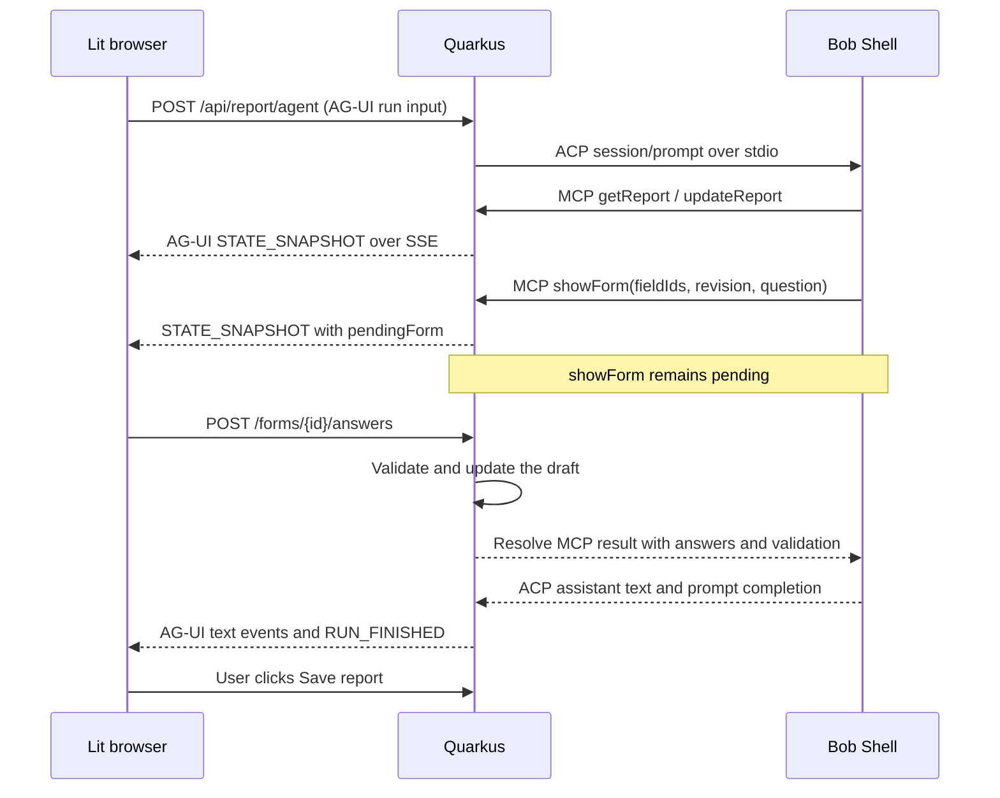

# Field Notes: Bob guides a reporting form

Field Notes turns rough developer advocacy notes into a complete activity report. Bob extracts facts and asks follow-up questions with native form controls. Java owns the field catalog, conditional requirements, validation, and the final save decision.

The names, products, policies, and example URLs are fictional. This is a single-user, in-memory teaching application. Saving freezes the report in this process; **Download JSON** gives you a durable copy. Resetting, restarting, or a Quarkus dev reload clears it. There is no connection to Microsoft Forms or an internal reporting system.

## Run it

Requirements: Java 21 or later, Maven, and an installed IBM Bob Shell. The live flow was tested with Bob Shell 2.0.2. Review Bob's license and configure access before running the demo:

```sh
bob --version
bob --show-license acp
```

The project uses Quarkus 3.39.3, Quarkus REST/Jackson, Quarkus MCP Server HTTP, Web Bundler 2.3.4, and Lit 3.3.3. Web Bundler resolves Lit from Maven and bundles the JavaScript and CSS. There is no separate frontend development server or npm install step.

The SmallRye ACP transport dependency is experimental (`io.smallrye.ai:acp-java-core:0.1.1-SNAPSHOT`). It must be installed in your local Maven repository first. From the parent directory, clone [SmallRye ACP Client](https://github.com/smallrye/smallrye-acp-client) and build a revision providing that version:

```sh
git clone https://github.com/smallrye/smallrye-acp-client.git smallrye-acp-client
cd smallrye-acp-client
mvn -DskipTests install
cd ../devrel-reporting-assistant
```

This snapshot prerequisite is the main reproducibility limitation. Check the upstream POM if its development version has advanced; do not silently substitute a different SDK version.

Provide a Bob Shell credential using either an environment variable:

```sh
export BOB_API_KEY='your-key'
```

or a path to an exported credential JSON containing an `apikey` property:

```sh
export BOB_KEY_FILE='/absolute/path/to/your-bob-credential.json'
```

You can put `BOB_KEY_FILE=...` in this module's ignored `.env` file for dev mode. Keep the credential file outside the repository. The app reads it on the server and passes the key to the Bob child process. It never sends the key to the browser or includes it in a report.

Start from this module directory:

```sh
./mvnw quarkus:dev
```

Open [Field Notes](http://127.0.0.1:8093). If you change the HTTP port, also set `BOB_CALLBACK_URL` to the origin Bob can reach, such as `http://127.0.0.1:8094`. The browser and backend use the same origin.

To package and run the JVM application:

```sh
./mvnw package
QUARKUS_HTTP_PORT=8093 java -jar target/quarkus-app/quarkus-run.jar
```

The native-image profile and container files are generated scaffolding. Native execution has not been verified, and the container files do not install Bob Shell. Use the JVM process on your development machine for this demo.

## Try the branches

Start a report for the current month. The two example buttons fill the notes box; you can edit the notes before sending them.

For a more demanding workshop, use a date in the selected month and report 32 on-site attendees, 18 remote attendees, and 55 exercise completions. Bob should ask you to correct the completions because the total attendance is 50. Answer 41, then choose travel, supporting materials, and an outstanding action to see their dependent questions.

Before saving, tell Bob that the workshop was entirely online with 50 remote attendees. Java removes the on-site and travel fields, including the trip report details. Changing it back requires fresh answers for those fields.

For a video, use `https://video.example.org/watch/runtime-intro`, choose **collect later**, and select **VidNest**. The report can become complete with metrics explicitly pending. It has no `views` value. Choosing **manual** instead requires a measured count, which may be zero, and a measurement date. No background collector is implemented.

| Condition | Required follow-up |
| --- | --- |
| Any activity | Date, advocate, product, title, type, observed outcome |
| Community OSS | Project name |
| Live engagement | Event, delivery, duration, audience, applicable attendance counts |
| Hybrid | Separate on-site and remote counts |
| Workshop | Exercise completions no greater than total attendance |
| Public audience | Public event or resource URL |
| Internal or private audience | Internal evidence; private customer also needs a fictional account alias |
| Talk or workshop | Materials URL, or an explicit reason materials are unavailable |
| In person or hybrid, with travel | Linked trip report, or a pending report due within 14 days of the activity |
| Article or recorded video | Public URL and manual measurements or explicit deferred collection |
| Proposed OSS contribution | Repository/change evidence and an action, owner, and due date |
| Released OSS contribution | Repository/change evidence and a release tag |
| Outstanding action | Action, owner, and non-overdue due date |

Unknown attendance is not zero. Dates must fit the reporting month and applicable date windows. URLs must use HTTPS; the application validates their syntax but does not fetch them.

## Three protocol boundaries



**AG-UI** carries the run lifecycle, assistant text, and application state between Quarkus and the browser. The example implements the relevant event subset with a small `fetch` SSE reader: `RUN_STARTED`, `STATE_SNAPSHOT`, `TEXT_MESSAGE_START`, `TEXT_MESSAGE_CONTENT`, `TEXT_MESSAGE_END`, `RUN_FINISHED`, and `RUN_ERROR`. It uses full snapshots, rather than JSON Patch state deltas. This is a custom client/adapter, not the AG-UI Java SDK or a complete implementation of every AG-UI feature. The application-specific `pendingForm` shape lives inside the shared state.

**ACP** connects Quarkus to Bob Shell. SmallRye owns the process and stdio transport; `BobAgent` handles JSON-RPC initialization, session creation, permissions, prompts, and streamed text. It passes the application's HTTP MCP server in `session/new` and checks that Bob advertises that capability.

**MCP** gives Bob discoverable tools. `@Tool` descriptions and generated input schemas explain each operation. `getReport` returns the current revision, catalog, and validation issues, so the model learns both what `showForm` accepts and which fields apply now. Bob chooses catalog field IDs; it cannot send arbitrary HTML or define new fields.

`showForm` returns a `Uni` backed by a pending future. The browser receives a form in an AG-UI snapshot. Its ordinary REST answer request validates and applies the answers, then resolves that same future. Bob receives the updated report as the MCP tool result and continues the same ACP prompt. The browser does not execute MCP calls.

The [AG-UI architecture](https://docs.ag-ui.com/concepts/architecture) defines the frontend/backend event boundary. The [Java SDK](https://github.com/ag-ui-protocol/ag-ui/blob/main/docs/sdk/java/overview.mdx) provides event types and an `HttpAgent` client for consuming an existing endpoint. Its core event types could replace this demo's handwritten maps, but the application would still need to translate Bob's ACP updates and stream report state from its own server endpoint. The example keeps that translation explicit for teaching purposes.

## Where to read the code

| File | Responsibility |
| --- | --- |
| `ReportRules.java` | Catalog, conditional requirements, value normalization, cross-field checks |
| `ReportSession.java` | Draft revisions, inactive-field removal, pending forms, event replay, save guard |
| `ReportingTools.java` | Three MCP tools and per-report credential check |
| `BobAgent.java` | Bob process, ACP requests, capability checks, narrow permission mapping |
| `ReportService.java` | One report and Bob session, agent instructions, stop/reset lifecycle |
| `ReportResource.java` | Browser REST endpoints and AG-UI SSE output |
| `web/app/app.js` | Lit application and run/reconnect handling |
| `web/app/question-card.js` | Native form controls selected from catalog field types |
| `web/app/report-summary.js` | Current values, unresolved requirements, save/download controls |
| `web/app/stream.js` | Streaming SSE parser |

All Java files are under `src/main/java/dev/mainthread/fieldnotes/`; frontend files are under `src/main/resources/`.

## Endpoints and lifecycle

| Method and path | Purpose |
| --- | --- |
| `POST /api/report` | Start a report with `month` and fictional `author` |
| `GET /api/report` | Restore the authoritative snapshot |
| `DELETE /api/report` | Reset the report and close Bob |
| `POST /api/report/agent` | Start an AG-UI run and stream events |
| `GET /api/report/events?after=...&runId=...` | Replay/resume an existing run; never starts another prompt |
| `POST /api/report/forms/{id}/answers` | Submit exactly the shown fields with `expectedRevision` |
| `POST /api/report/stop` | Close Bob, release a pending form, preserve the draft |
| `POST /api/report/save` | Validate and freeze a complete report at `expectedRevision` |
| `GET /api/report/download` | Download saved values as JSON |
| `/mcp` | Quarkus MCP Server HTTP transport |

A report allows one active run and one pending form. Revisions reject stale writes. An identical answer retry is idempotent; a different answer to an already completed form is rejected. Forms expire after five minutes by default. SSE events have sequence IDs and bounded replay history. Reloading restores the current snapshot and attaches to the existing run.

The backend accepts only catalog fields with appropriate types. It retains cross-field errors so Bob can ask for a correction, and recalculates completeness after every change. Bob cannot call a save tool. The Save button becomes available only after the report is valid and Bob has finished.

The default HTTP host is loopback. This demo has one global report and no user authentication; keep it on a developer machine. Each Bob session gets a fresh MCP credential in an HTTP header. The browser never receives it. ACP permission approval is limited to Bob 2.0.2's titles for the three reporting tools; unfamiliar tool titles are denied. Other Bob versions may need an adapter update. Bob runs in a temporary workspace and no ACP filesystem capabilities are advertised.

Useful settings are `BOB_BINARY`, `BOB_API_KEY`, `BOB_KEY_FILE`, `BOB_CALLBACK_URL`, `BOB_FORM_TIMEOUT` (default `5m`), and `BOB_PROMPT_TIMEOUT` (default `30m`).

## Verification

```sh
./mvnw test
```

The 28 Java tests cover conditional requirements, invalid values, attendance corrections, branch clearing, revisions, duplicate submissions, cancellation/expiry, save guards, ordered event replay, REST lifecycle, and unauthenticated MCP tool denial. They do not call the paid Bob service and do not require a Bob key. JavaScript tests would be a great addition when extending the frontend: feed the SSE reader split messages and interrupted streams to verify event reconstruction and error handling.

Live verification also exercised a real Bob workshop run, browser form answers, reload/reconnect, a change from hybrid to online delivery, save/JSON download, and a video with deferred metrics and no invented view count. The key used for this check is not part of the project.

Framework references: [Quarkus REST](https://quarkus.io/guides/rest), [MCP Server tools](https://docs.quarkiverse.io/quarkus-mcp-server/dev/guides-implementing-tools.html), [Web Bundler](https://docs.quarkiverse.io/quarkus-web-bundler/dev/), and [Lit](https://lit.dev/docs/).
