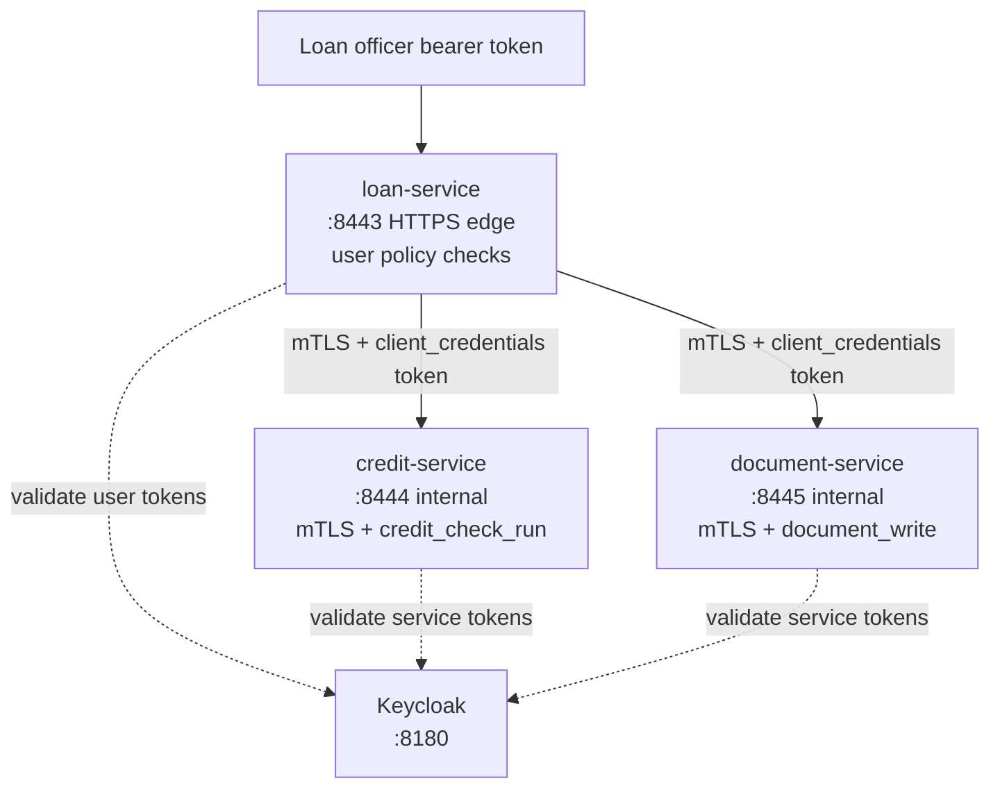
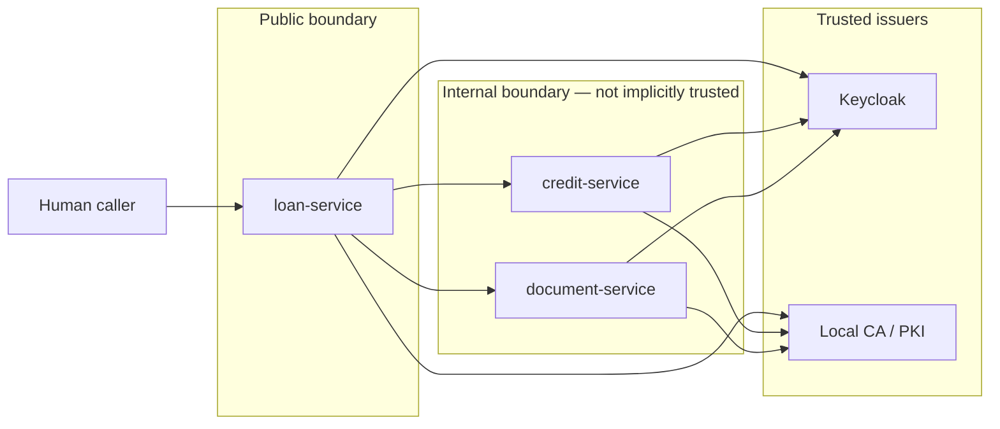
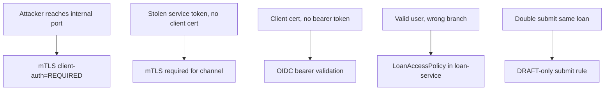
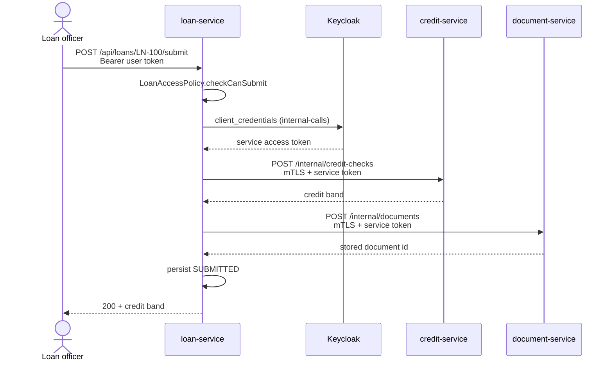
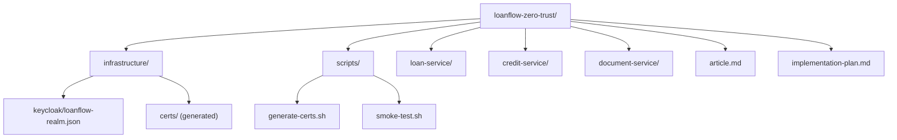

# LoanFlow Zero-Trust — Implementation Plan

Hands-on build spec for a three-service Quarkus demo: mTLS on internal hops, OIDC service tokens on outbound REST clients, and branch-level business policy at the edge.

**Companion files:** `article.md` (reader tutorial), this plan (agent/maintainer spec), runnable code in `loan-service/`, `credit-service/`, `document-service/`.

**Runtime:** JDK 25. Use the Quarkus CLI / generated Maven wrapper with the **current platform BOM** — do not hard-code a Quarkus version in prose or tutorial commands.

---

## What readers prove at the end

1. Alice (Berlin branch) reads and submits `LN-100` through `loan-service` → `200`
2. Bob (Hamburg branch) reads `LN-100` → `403` from edge policy
3. Direct call to `credit-service` without client certificate → TLS handshake failure
4. Direct call with mTLS but no bearer token → `403`
5. Full submit through edge → credit + document internal calls succeed; resubmit → `409`

---

## System overview



---

## Architectural boundaries



**Transport** — App-managed mTLS via [Quarkus TLS registry](https://quarkus.io/guides/tls-registry-reference). No service mesh in this demo.

**Service identity** — `loan-service` acquires a `client_credentials` token through [OIDC client + REST client filter](https://quarkus.io/guides/security-openid-connect-client-reference). No hand-rolled `Authorization` headers.

**Business authorization** — Branch ownership and loan state live in `loan-service` only. Downstream services answer: “Is this an allowed internal caller with the right permission?” They do **not** evaluate human loan-officer context.

**Explicitly out of scope** — service mesh, OPA, Keycloak authorization services, end-user token propagation to downstream services.

---

## Threat model



**Assets:** loan PII, credit results, audit documents, service credentials, private keys.

**Trust boundaries:** public surface ends at `loan-service`; internal services require both channel trust (mTLS) and caller permission (bearer scope).

---

## Submit flow (happy path)



---

## Repository layout



No shared DTO JAR in v1 — duplicate small request/response records per service until the demo works.

---

## Prerequisites (implementation)

- JDK 25 (`--java=25` on `quarkus create`)
- Podman (Dev Services starts Keycloak)
- OpenSSL, `keytool`, `curl`, `jq`
- Quarkus CLI (current)

---

## Step 1 — Generate three Quarkus apps

From `loanflow-zero-trust/`:

```bash
quarkus create app com.mainthread.loanflow:loan-service \
  --extension='rest-jackson,rest-client-jackson,oidc,rest-client-oidc-filter,tls-registry,smallrye-health' \
  --java=25 --no-code

quarkus create app com.mainthread.loanflow:credit-service \
  --extension='rest-jackson,oidc,tls-registry,smallrye-health' \
  --java=25 --no-code

quarkus create app com.mainthread.loanflow:document-service \
  --extension='rest-jackson,oidc,tls-registry,smallrye-health' \
  --java=25 --no-code
```

Add test dependencies to all three modules: `rest-assured` (test), `quarkus-test-security-oidc` (test). Credit and document services also need `quarkus-test-oidc-server` for `OidcWiremockTestResource`.

---

## Step 2 — Certificates

Run `./scripts/generate-certs.sh`.

Rules:

- One local CA; one cert per service (`CN` = service name)
- SANs: `DNS:localhost`, `IP:127.0.0.1`
- PKCS12 password: `changeit` (local dev only)
- Shared `truststore.p12` contains CA only
- Never use `trust-all=true` or disable hostname verification

Output per service: `tls.key`, `tls.crt`, `keystore.p12`.

---

## Step 3 — Keycloak via Dev Services

Copy `infrastructure/keycloak/loanflow-realm.json` to `src/main/resources/loanflow-realm.json` in **each** module.

Dev mode configuration (all three services):

```properties
quarkus.oidc.application-type=service

quarkus.keycloak.devservices.realm-name=loanflow
quarkus.keycloak.devservices.realm-path=loanflow-realm.json
quarkus.keycloak.devservices.port=8180
```

Do **not** set `quarkus.oidc.auth-server-url` in dev — that disables [Dev Services for Keycloak](https://quarkus.io/guides/security-openid-connect-dev-services). Quarkus starts Keycloak in Podman, imports the realm, and sets the auth server URL at runtime. Container sharing is on by default, so one Keycloak instance serves all three dev processes.

`loan-service` also needs:

```properties
quarkus.oidc-client.internal-calls.auth-server-url=${quarkus.oidc.auth-server-url}
quarkus.oidc-client.internal-calls.client-id=loan-service
quarkus.oidc-client.internal-calls.credentials.secret=loan-service-secret
quarkus.oidc-client.internal-calls.grant.type=client
quarkus.oidc-client.internal-calls.early-tokens-acquisition=false
```

Production profile overrides (example):

```properties
%prod.quarkus.oidc.auth-server-url=${KEYCLOAK_URL}/realms/loanflow
%prod.quarkus.keycloak.devservices.enabled=false
```

**Users**

- `alice` / `alice` — role `loan_officer`, attribute `branch=berlin`
- `bob` / `bob` — role `loan_officer`, attribute `branch=hamburg`
- `admin` / `admin` — role `loan_admin`, attribute `branch=hq`

**Clients**

- `loanflow-cli` — confidential, direct access grants, secret `loanflow-cli-secret` (local token retrieval only)
- `loan-service` — confidential, service account, secret `loan-service-secret`, default client scopes `credit_check_run` and `document_write`

**Token mapping**

- Realm roles → `@RolesAllowed` groups on `loan-service`
- Custom `branch` client scope → `branch` claim on user tokens
- Service token `scope` claim → `@PermissionsAllowed` on internal services

---

## Step 4 — loan-service

**Package:** `com.mainthread.loanflow.loan`

**Classes**

- `LoanResource` — `GET /api/loans/{id}`, `POST /api/loans/{id}/submit`
- `LoanApplicationService` — orchestration
- `LoanAccessPolicy` — branch + admin + DRAFT rules via `SecurityIdentity`
- `LoanRepository` + `LoanDataSeeder` — in-memory seed data
- `client/CreditServiceClient`, `client/DocumentServiceClient` — `@OidcClientFilter("internal-calls")`

**Seeded loans:** `LN-100` berlin DRAFT, `LN-200` hamburg DRAFT, `LN-300` berlin SUBMITTED.

**Configuration highlights** — see `loan-service/src/main/resources/application.properties`:

- Edge TLS on 8443 (`quarkus.http.tls-configuration-name=edge`)
- Outbound TLS bucket `internal-client` with client keystore + truststore
- Named OIDC client `internal-calls` with `early-tokens-acquisition=false`
- REST clients point at `https://localhost:8444` and `:8445`

**Tests**

- `LoanAccessPolicyTest` — unit tests
- `LoanResourceSecurityTest` — `@QuarkusTest` + `@TestSecurity` for branch/admin/401

---

## Step 5 — credit-service

**Package:** `com.mainthread.loanflow.credit`

- `POST /internal/credit-checks` with `@PermissionsAllowed("credit_check_run")`
- Deterministic fake scoring in `CreditDecisionService`
- mTLS server on 8444, `quarkus.http.ssl.client-auth=REQUIRED`

**Tests:** `CreditResourceSecurityTest` — 401 without token via `OidcWiremockTestResource`.

Test profile disables mTLS and uses classpath test keystores so `@QuarkusTest` starts without production cert tree.

---

## Step 6 — document-service

**Package:** `com.mainthread.loanflow.document`

- `POST /internal/documents` with `@PermissionsAllowed("document_write")`
- In-memory `DocumentStore`
- mTLS on 8445

**Tests:** same pattern as credit-service.

---

## Step 7 — Run and verify

```bash
./scripts/generate-certs.sh   # if not already done

cd loan-service && ./mvnw quarkus:dev
cd credit-service && ./mvnw quarkus:dev
cd document-service && ./mvnw quarkus:dev

./scripts/smoke-test.sh
```

The first `quarkus:dev` starts Keycloak in Podman on port 8180. Module tests: `./mvnw test` in each service directory.

---

## Configuration failure matrix

**loan-service**

- Missing `edge` TLS config → no HTTPS on 8443
- Wrong `internal-client` truststore → downstream `PKIX path building failed`
- Missing OIDC client `internal-calls` → REST client cannot acquire service token
- `early-tokens-acquisition=true` → token may expire before first downstream call

**credit-service / document-service**

- Missing `client-auth=REQUIRED` → token-only callers reach internal API over TLS
- Truststore missing CA → valid client certs fail handshake
- Wrong OIDC URL → all requests `401`

**loan-service policy**

- Wrong `branch` claim or role → `403` at edge (expected for cross-branch)

---

## Production follow-ups

- Replace local CA with real PKI or cert-manager
- Externalize secrets (not plain `application.properties`)
- `quarkus.ssl.native=true` for native HTTPS clients
- Certificate and client-secret rotation
- Correlation IDs across services
- Audience enforcement or token exchange if downstream needs user context later

Do not move branch policy into internal services just because the local demo works.

---

## Implementation checklist

- [x] `scripts/generate-certs.sh`
- [x] `scripts/smoke-test.sh`
- [x] `infrastructure/keycloak/loanflow-realm.json` (+ copies in each module `src/main/resources/`)
- [x] `loan-service` — edge TLS, OIDC, branch policy, outbound REST clients
- [x] `credit-service` — mTLS, `@PermissionsAllowed("credit_check_run")`
- [x] `document-service` — mTLS, `@PermissionsAllowed("document_write")`
- [x] Module tests (`@QuarkusTest`, policy unit tests, OIDC wiremock on internal services)
- [x] Smoke script covering transport failure, token failure, and business-policy failure
- [x] `article.md` — reader-facing tutorial
- [x] Mermaid diagrams for flows (this plan + article)

**Done when:** at least one transport failure, one token failure, and one business-policy failure are reproducible with commands or tests.

---

## Tags

`quarkus`, `security`, `zero-trust`, `mtls`, `oidc`, `microservices`
