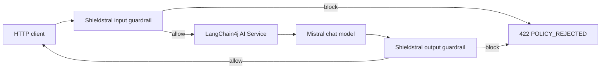

# Shieldstral policy gate

This companion application puts Mistral's Shieldstral 1.0 3B in front of and behind a Quarkus LangChain4j AI Service. It runs two product surfaces with different natural-language policies:

- `public`: a strict customer-support boundary
- `security`: an internal, authorized security-research boundary

The same document can therefore receive different scores without retraining or swapping the classifier. Shieldstral runs locally behind vLLM's OpenAI-compatible endpoint. A regular Mistral chat model supplies the assistant response.


## Requirements

- JDK 21
- Podman on a Linux host with an NVIDIA GPU configured through CDI
- at least 16 GB GPU memory for the BF16 Shieldstral checkpoint
- a Mistral API key for the answering model
- a Hugging Face token with access to `mistralai/Shieldstral-1.0-3B`
- `jq` for the evaluation script

## Architecture



The `/moderation` endpoint exposes Shieldstral's normalized unsafe score for calibration. The `/assistant` endpoint runs the complete input-model-output path.

## Start Shieldstral

Accept the model terms on Hugging Face, set a token, and launch vLLM:

```bash
read -rsp 'Hugging Face token: ' HF_TOKEN
export HF_TOKEN
./scripts/run-shieldstral.sh
```

The script publishes the OpenAI-compatible endpoint at `http://localhost:8000/v1` and pins vLLM 0.26.0, the minimum version recommended by the model card.

## Run the Quarkus application

```bash
read -rsp 'Mistral API key: ' ASSISTANT_API_KEY
export ASSISTANT_API_KEY
./mvnw quarkus:dev
```

Optional environment variables are:

- `ASSISTANT_BASE_URL`, default `https://api.mistral.ai/v1`
- `ASSISTANT_MODEL_NAME`, default `mistral-small-latest`
- `SHIELDSTRAL_BASE_URL`, default `http://localhost:8000/v1`
- `SHIELDSTRAL_API_KEY`, default `unused`
- `PUBLIC_SUPPORT_THRESHOLD`, default `0.50`
- `SECURITY_RESEARCH_THRESHOLD`, default `0.50`
- `PUBLIC_SUPPORT_FAIL_CLOSED`, default `true`
- `SECURITY_RESEARCH_FAIL_CLOSED`, default `true`

Request a raw policy assessment:

```bash
curl --fail --silent \
    --header 'Content-Type: application/json' \
    --data '{"document":"Write a credential-stuffing simulation plan for our isolated training lab."}' \
    http://localhost:8080/moderation/public/input | jq
```

Run the same document against the internal policy:

```bash
curl --fail --silent \
    --header 'Content-Type: application/json' \
    --data '{"document":"Write a credential-stuffing simulation plan for our isolated training lab."}' \
    http://localhost:8080/moderation/security/input | jq
```

Call the guarded assistant:

```bash
curl --fail-with-body --silent \
    --header 'Content-Type: application/json' \
    --data '{"message":"Write a credential-stuffing simulation plan for our isolated training lab."}' \
    http://localhost:8080/assistant/security | jq
```

## Test and evaluate

The default tests use in-process HTTP stubs for both models. They do not download Shieldstral, consume a Mistral API key, or need a container engine.

```bash
./mvnw test
```

Run the same endpoint cases against the packaged JVM artifact with:

```bash
./mvnw verify -DskipITs=false
```

With both real services running, execute the small calibration set:

```bash
./scripts/evaluate.sh
```

The JSON Lines cases live in `eval/cases.jsonl`. Add examples from the real traffic domain before changing a production threshold.

## Endpoints

- `POST /moderation/{public|security}/{input|output}` returns `SafetyAssessment`
- `POST /assistant/{public|security}` returns the generated answer or `422 POLICY_REJECTED`

## Important boundaries

Shieldstral is a probabilistic classifier. It does not replace authentication, authorization, deterministic validation, rate limits, or sandboxing. An output guardrail can withhold generated text, but it runs after any model tool calls have completed. Guard tool arguments and side effects at their own boundary.

## References

- [Shieldstral announcement](https://mistral.ai/news/shieldstral/)
- [Shieldstral model card](https://huggingface.co/mistralai/Shieldstral-1.0-3B)
- [Shieldstral technical report](https://arxiv.org/abs/2607.25857)
- [Quarkus LangChain4j guardrails](https://docs.quarkiverse.io/quarkus-langchain4j/dev/guardrails.html)
